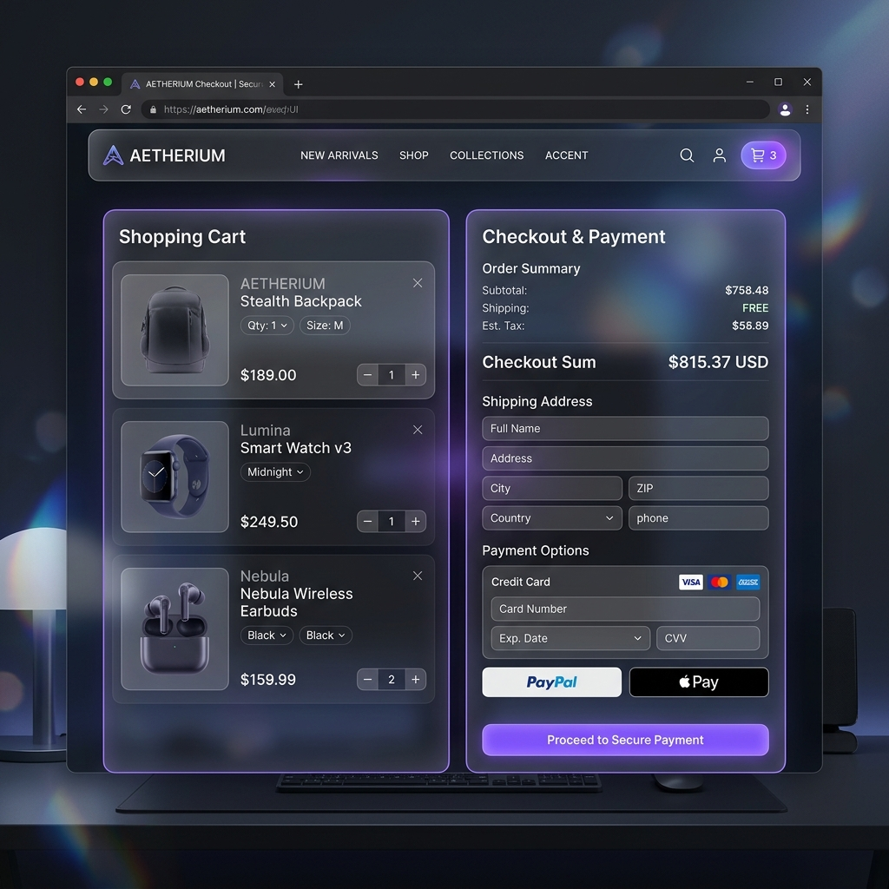

# MERN STACK INTERNSHIP
# DAY 13 ASSIGNMENT REPORT
# (SHOPPING CART & CHECKOUT MODULE)

**Allocation Date** – 15th June 2026  
**Submission Date** – 15th June 2026  

**Name:** PARTH SHARMA  
**Role:** MERN Stack Developer Intern  
**Position:** MERN Stack Intern  
**Internship Organization:** Insta Dot Analytics  

---

## TASK 1 - SHOPPING CART SCHEMA AND MONGODB STORAGE
### Objective:
To design and implement a persistent Shopping Cart data model in MongoDB linked to authenticated users.

### Description:
A MongoDB schema for the Shopping Cart was created using Mongoose. The model maintains a reference to the User schema and holds an array of cart items, each storing a reference to the Product model and the selected quantity.

### Implementation:
- Created the Cart Mongoose Schema with validation (minimum quantity of 1).
- Associated cart items uniquely per authenticated user.
- Configured relational populates to resolve full product details dynamically.

---

## TASK 2 - CART CRUD REST APIs (Express.js)
### Objective:
To construct REST endpoints allowing client-side actions to fetch, add, update, and remove items from the database-backed cart.

### Description:
Using Express routers, endpoints were registered and protected by JWT auth middleware. The controller handles add operations by incrementing existing item counts or pushing new array elements, updating quantities, and clearing carts.

### Endpoints Implemented:
- `GET /api/cart` → Fetches authenticated user's populated cart.
- `POST /api/cart/add` → Adds item or increases quantity.
- `PUT /api/cart/update` → Modifies quantity of a target product.
- `DELETE /api/cart/remove/:productId` → Deletes product from the cart.
- `POST /api/cart/clear` → Truncates the items array.

---

## TASK 3 - REACT HOOKS AND CART CONTEXT STATE MANAGEMENT
### Objective:
To establish a centralized React Context with custom hooks (`useCart`) to consume cart operations reactively across catalog, cart details, and checkout views.

### Description:
The `CartProvider` tracks local cart state using React hooks and updates immediately upon user interactions. Requests are dispatched asynchronously to the MERN backend using authenticated fetch calls.

---

## TASK 4 - RESPONSIVE SHOPPING CART & CHECKOUT PAGE UI
### Objective:
To develop state-of-the-art, responsive web views for the Cart and Checkout operations matching custom glassmorphism styling parameters.

### Features:
- **Cart Page:** Dynamic unit price and subtotal calculation, quantity selectors, checkout redirection, and free shipping calculations.
- **Checkout Page:** Complete shipping address form, mock Credit/Debit Card payment forms, responsive order summaries, and success completion cards.

---

## ALL THE OUTPUTS -

### TASK 1 - SHOPPING CART SCHEMA
#### Output 13.1 - Mongoose Schema Model
```javascript
import mongoose from 'mongoose';

const CartItemSchema = new mongoose.Schema({
  product: {
    type: mongoose.Schema.Types.ObjectId,
    ref: 'Product',
    required: true,
  },
  quantity: {
    type: Number,
    required: true,
    min: [1, 'Quantity must be at least 1'],
    default: 1,
  },
});

const CartSchema = new mongoose.Schema(
  {
    user: {
      type: mongoose.Schema.Types.ObjectId,
      ref: 'User',
      required: true,
      unique: true,
    },
    items: [CartItemSchema],
  },
  {
    timestamps: true,
  }
);

export default mongoose.model('Cart', CartSchema);
```

### TASK 4 - RESPONSIVE CART & CHECKOUT UI MOCKUP
#### Output 13.2 - Shopping Cart & Checkout Mockup


---

## FINAL CONCLUSION
The addition of the Shopping Cart and Checkout pages concludes a complete transaction flow for the MERN Stack application. Persistent database storage in MongoDB guarantees cart stability between user sessions, and custom React Hooks provide seamless client state updates.

THANK YOU!
